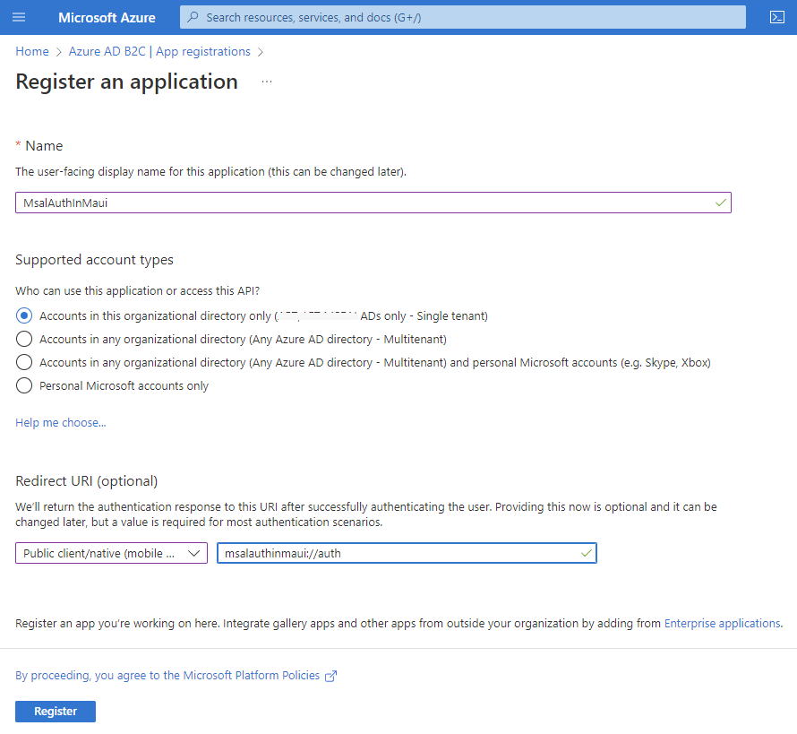
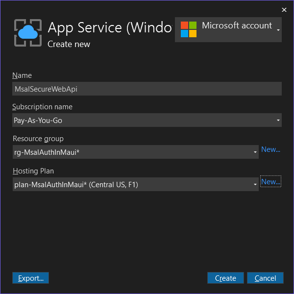

# Table of Contents

- [Table of Contents](#table-of-contents)
  - [Introduction](#introduction)
  - [Prerequisites](#prerequisites)
    - [.NET 6.0](#net-60)
    - [Visual Studio 2022](#visual-studio-2022)
    - [Required Workloads](#required-workloads)
  - [Demo](#demo)
    - [Secure ASP.NET Core Web API Application](#secure-aspnet-core-web-api-application)
      - [ASP.NET Core Web API Application](#aspnet-core-web-api-application)
      - [Secure ASP.NET Core Web API](#secure-aspnet-core-web-api)
      - [Azure AD B2C App Registration](#azure-ad-b2c-app-registration)
      - [Deploy ASP.NET Core Web API to Azure](#deploy-aspnet-core-web-api-to-azure)
      - [Configure Azure AD B2C Scope](#configure-azure-ad-b2c-scope)
      - [Set API Permissions](#set-api-permissions)
  - [Summary](#summary)
  - [Complete Code](#complete-code)
  - [Resources](#resources)

## Introduction

In this episode, we are going to build a secure `ASP.NET Core Web API` application, and deploy it to `Azure`. Then, we are going to build a `.NET Multi-platform App UI (.NET MAUI)` application, and I am going to show you how you can leverage `Microsoft Authentication Library (MSAL)` for `.NET` to get an access token, which we are going to use to call the Web API application.

The `Microsoft Authentication Library (MSAL)` allows you to acquire tokens from the `Microsoft identity platform`, authenticate users, and call secure web APIs not only from .NET, but from multiple platforms such as JavaScript, Java, Python, Android, and iOS.

You can find more information about `MSAL` here [Overview of the Microsoft Authentication Library (MSAL)](https://docs.microsoft.com/en-us/azure/active-directory/develop/msal-overview)

End results will look like this:


Let's get started.

## Prerequisites

The following prerequisites are needed for this demo.

### .NET 6.0

Download the latest version of the .NET 6.0 SDK [here](https://dotnet.microsoft.com/en-us/download).

### Visual Studio 2022

For this demo, we are going to use the latest version of [Visual Studio 2022](https://visualstudio.microsoft.com/vs/community/).

### Required Workloads

In order to build ASP.NET Core Web API applications, the `ASP.NET and web development` workload needs to be installed. In order to build `.NET MAUI` applications, you also need the `.NET Multi-platform App UI development` workload, so if you do not have them installed let's do that now.

  

## Demo

In the following demo we will perform the following actions:

1. Create a secure `ASP.NET Core Web API` application
2. Deploy the `ASP.NET Core Web API` application in Azure
3. Create and configure an `Azure AD B2C` app registration to provide authentication workflows
4. Create a `.NET MAUI` application
5. Configure our `.NET MAUI` application to authenticate users and get an access token
6. Call our secure `ASP.NET Core Web API` application from our `.NET MAUI` application

As you can see there are many steps in this demo, so let's get to it.

### Secure ASP.NET Core Web API Application

In this demo, we are going to start by creating an `ASP.NET Core Web API ` application using the default template, which will not be secure. We are going to make it secure by using the `Microsoft identity` platform.

We will create an `Azure AD B2C` app registration to provide an authentication flow, and configure our `ASP.NET Core Web API` application to use it.

And finally, we will deploy the `ASP.NET Core Web API` application to Azure.

#### ASP.NET Core Web API Application

  

  

  

>:point_up: Notice I unchecked `Use controllers (uncheck to use minimal APIs)` to create a minimal API, and checked `Enable OpenAPI support` to include `Swagger`.

You can learn more about minimal APIs here: [Minimal APIs overview](https://docs.microsoft.com/en-us/aspnet/core/fundamentals/minimal-apis?view=aspnetcore-6.0>)

Run the application to make sure the default templates is working.

  

Expand `GET /weatherforecast`, click on `Try it out`, then on `Execute`.

  

We get data, so it is working, but it is not secure.

#### Secure ASP.NET Core Web API

Let's make our `ASP.NET Core Web API` app secure.

Open the `Package Manager Console`:

  

And add the following `NuGet` packages:

- Microsoft.AspNetCore.Authentication.JwtBearer
- Microsoft.Identity.Web
- Microsoft.Identity.Web.MicrosoftGraph
- Microsoft.Identity.Web.UI

By running the following commands:

```powershell
install-package Microsoft.AspNetCore.Authentication.JwtBearer
install-package Microsoft.Identity.Web
install-package Microsoft.Identity.Web.MicrosoftGraph
install-package Microsoft.Identity.Web.UI
```

Your project file should look like this:

```xml
<Project Sdk="Microsoft.NET.Sdk.Web">

  <PropertyGroup>
    <TargetFramework>net6.0</TargetFramework>
    <Nullable>enable</Nullable>
    <ImplicitUsings>enable</ImplicitUsings>
  </PropertyGroup>

  <ItemGroup>
    <PackageReference Include="Microsoft.AspNetCore.Authentication.JwtBearer" Version="6.0.8" />
    <PackageReference Include="Microsoft.Identity.Web" Version="1.25.1" />
    <PackageReference Include="Microsoft.Identity.Web.MicrosoftGraph" Version="1.25.1" />
    <PackageReference Include="Microsoft.Identity.Web.UI" Version="1.25.1" />
    <PackageReference Include="Swashbuckle.AspNetCore" Version="6.2.3" />
  </ItemGroup>

</Project>
```

Open the *Program.cs* file and add the following using statements:

```csharp
using Microsoft.Identity.Web;
using Microsoft.AspNetCore.Authentication.JwtBearer;
```

Below `var builder = WebApplication.CreateBuilder(args);`, add the following code:

```csharp
builder.Services.AddAuthentication(JwtBearerDefaults.AuthenticationScheme)
    .AddMicrosoftIdentityWebApi(builder.Configuration.GetSection("AzureAd"))
        .EnableTokenAcquisitionToCallDownstreamApi()
            .AddMicrosoftGraph(builder.Configuration.GetSection("MicrosoftGraph"))
            .AddInMemoryTokenCaches()
            .AddDownstreamWebApi("DownstreamApi", builder.Configuration.GetSection("DownstreamApi"))
            .AddInMemoryTokenCaches();
builder.Services.AddAuthorization();
```

At the bottom, before `app.Run();` add the following two lines:

```csharp
app.UseAuthentication();
app.UseAuthorization();
```

And finally, in the `app.MapGet("/weatherforecast"` code, add the following line after `.WithName("GetWeatherForecast")`:

```csharp
.RequireAuthorization()
```

The complete *Program.cs* file should look like this now:

```csharp
using Microsoft.Identity.Web;
using Microsoft.AspNetCore.Authentication.JwtBearer;

var builder = WebApplication.CreateBuilder(args);

// Add services to the container.
builder.Services.AddAuthentication(JwtBearerDefaults.AuthenticationScheme)
    .AddMicrosoftIdentityWebApi(builder.Configuration.GetSection("AzureAd"))
        .EnableTokenAcquisitionToCallDownstreamApi()
            .AddMicrosoftGraph(builder.Configuration.GetSection("MicrosoftGraph"))
            .AddInMemoryTokenCaches()
            .AddDownstreamWebApi("DownstreamApi", builder.Configuration.GetSection("DownstreamApi"))
            .AddInMemoryTokenCaches();
builder.Services.AddAuthorization();

// Learn more about configuring Swagger/OpenAPI at https://aka.ms/aspnetcore/swashbuckle
builder.Services.AddEndpointsApiExplorer();
builder.Services.AddSwaggerGen();

var app = builder.Build();

// Configure the HTTP request pipeline.
if (app.Environment.IsDevelopment())
{
    app.UseSwagger();
    app.UseSwaggerUI();
}

app.UseHttpsRedirection();

var summaries = new[]
{
    "Freezing", "Bracing", "Chilly", "Cool", "Mild", "Warm", "Balmy", "Hot", "Sweltering", "Scorching"
};

app.MapGet("/weatherforecast", () =>
{
    var forecast = Enumerable.Range(1, 5).Select(index =>
        new WeatherForecast
        (
            DateTime.Now.AddDays(index),
            Random.Shared.Next(-20, 55),
            summaries[Random.Shared.Next(summaries.Length)]
        ))
        .ToArray();
    return forecast;
})
.WithName("GetWeatherForecast")
.RequireAuthorization();

app.UseAuthentication();
app.UseAuthorization();

app.Run();

internal record WeatherForecast(DateTime Date, int TemperatureC, string? Summary)
{
    public int TemperatureF => 32 + (int)(TemperatureC / 0.5556);
}
```

The `ASP.NET Core Web API` app is secure now, but we need to add some IDs, and settings in the *appsettings.json* file.

Open the *appsettings.json* file, and add the following section above the `"Logging"` section:

```json
  "AzureAd": {
    "Instance": "",
    "Domain": "",
    "TenantId": "",
    "ClientId": "",
    "CallbackPath": "",
    "Scopes": "",
    "ClientSecret": "",
    "ClientCertificates": []
  },
```

#### Azure AD B2C App Registration

In order to get the settings required, we need to create an `Azure AD B2C` app registration.

Go to https://portal.azure.com and sign-in.

>:blue_book: If you do not have an Azure account, you can sign-up for free at https://azure.microsoft.com/en-us/free/.

Search for `Azure AD B2C`, and select it from the list:

  

Click on `App registrations`.

  

Then click on `Add new registration`.

  

Fill-out the following values and click `Register`.

  

You will be presented with the Overview page, which has useful information such as Application ID, and Tenant ID. There are also some valuable links to quick start guides. Feel free to look around.

  

Copy the `Application (client) ID` value, and use that to fill the `"ClientId"` setting, and then copy the `Directory (tenant) ID` value to fill the `"TenantId"` setting in the *appsettings.json* file.

Set Instance to `https://login.microsoftonline.com/`, and CallbackPath to `"/signin-oidc"`.

For the `"Domain"`, go to `Branding & properties`, and copy the value under `Publisher domain`.

  

Now, we need to create a client secret. Go to `Certificates & secrets`, then click on `+ New client secret`, give it a description, set an expiration option, and click on the `Add` button.

  

This will generate a client secret. Copy the value, paste it under the `"ClientSecret"` setting in the *appsettings.json* file.

  

>:warning: The client secret will only display at this moment; if you move to another screen, you will not be able to retrieve the value anymore. You may choose to store this value safely at this point in `Azure Key Vault`, or some other safe location. If you lose it, you will have to create a new client secret.

Finally, set the `"Scopes"` value to `"access_as_user"`, which we are going to configure in `Azure AD B2C` in the [Configure Azure AD B2C Scope](#configure-azure-ad-b2c-scope) section, after we deploy our application to Azure.

The complete *appsettings.json* should look like this:

```json
{
  "AzureAd": {
    "Instance": "https://login.microsoftonline.com/",
    "Domain": "*********.onmicrosoft.com",
    "TenantId": "********-****-****-*****************",
    "ClientId": "13e64f59-38fb-4497-80d2-0a0f939564b3",
    "CallbackPath": "/signin-oidc",
    "Scopes": "access_as_user",
    "ClientSecret": "eoc8Q~9HZMliF5NY1***********************",
    "ClientCertificates": []
  },
  "Logging": {
    "LogLevel": {
      "Default": "Information",
      "Microsoft.AspNetCore": "Warning"
    }
  },
  "AllowedHosts": "*"
}
```

>:point_up: Some values were replaced with asterisks for security reasons.

Build and run the application, expand `GET /weatherforecast` again, click on `Try it out`, then on `Execute`.

This time, you should get an Unauthorized 401 HTTP code back.

  

Our Web API application is secure!

#### Deploy ASP.NET Core Web API to Azure

Right-click on the *SecureWebApi.csproj* file, and select `Publish...`, then follow the following steps:

  

  

  

  

  

  

  

  

  

  

  

  

#### Configure Azure AD B2C Scope

Now, we need to create our `access_as_user` scope we specified in the *appsettings.json* file.

Go back to the Azure portal, select `Expose an API`, then click on `+ Add a scope`, leave the default value for `Application ID URI`, and click `Save and continue`.


Fill-in the required values as shown below, and click on `Add scope`:


The `access_as_user` scope has been added.

  

#### Set API Permissions

Finally, we need to set the `API Permissions`, so our `MAUI` application can call the Web API with an access token, after authentication.

In order to do that, click on `API permissions`, then `+ Add a permission`. Select `My APIs`, and click on `MsalAuthInMaui`.

  

Then keep the `Delegated permissions` selected, check the `access_as_user` permission, and click on `Add permissions`.


  

## Summary

For more information about the `Microsoft Authentication Library (MSAL)`, check out the links in the resources section below.

## Complete Code

The complete code for this demo can be found in the link below.

- <https://github.com/payini/MsalAuthInMaui>

## Resources

| Resource Title                                          | Url                                                                                          |
| ------------------------------------------------------- | -------------------------------------------------------------------------------------------- |
| The .NET Show with Carl Franklin                        | <https://www.youtube.com/playlist?list=PL8h4jt35t1wgW_PqzZ9USrHvvnk8JMQy_>                   |
| Download .NET                                           | <https://dotnet.microsoft.com/en-us/download>                                                |
| Overview of the Microsoft Authentication Library (MSAL) | <https://docs.microsoft.com/en-us/azure/active-directory/develop/msal-overview>              |
| Minimal APIs overview                                   | <https://docs.microsoft.com/en-us/aspnet/core/fundamentals/minimal-apis?view=aspnetcore-6.0> |
